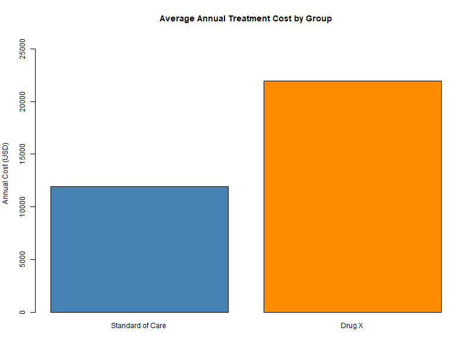

# Real-World Cost-Effectiveness & Value Communication Dashboard

## Project Purpose & Objective
This project implements a foundational Health Economics and Outcomes Research (HEOR)
model evaluating the value of a novel therapeutic intervention ("Drug X") compared
against the existing Standard of Care (SoC). Using simulated real-world data (RWD) for
1,000 patients, the tool evaluates clinical efficacy (reduction in hospitalizations),
patient quality of life, and economic viability.

## Repository Structure
```
health-economics-dashboard/
│
├── README.md                    <-- project overview & how to interpret results
├── analysis.R                   <-- Layman-level R script for data simulation & stats
├── code_understanding.txt       <-- Human-readable step-by-step code guide
├── budget_impact_model.xlsx     <-- Interactive stakeholder spreadsheet tool (optional)
├── patient_dataset.csv          <-- Simulated RWD dataset with analysis script
└── output/
    └── icer_plot.png            <-- Cost-effectiveness visualization generated by R
```

## How to Run
1. Install R (and RStudio, optional but recommended).
2. Open `analysis.R`.
3. Run the script top to bottom — no external packages are required, only base R.
4. Two outputs are generated automatically:
   - `patient_dataset_output.csv` — the full simulated dataset
   - `output/icer_plot.png` — a bar chart comparing average annual cost by group

## Methodology & Interpretation Framework
1. **Data Synthesis:** Simulated 1,000 patient rows split evenly across Drug X and SoC
   arms to capture real-world variables like treatment cost, hospital stays, and
   Quality-Adjusted Life Years (QALYs).
2. **Efficacy Metrics:** Assessed via an independent two-sample t-test comparing
   average annual hospitalization numbers.
3. **Economic Viability:** Measured using the Incremental Cost-Effectiveness Ratio
   (ICER), calculated as incremental cost divided by incremental QALY gain.

## Results

| Metric | Standard of Care | Drug X |
|---|---:|---:|
| Mean annual treatment cost | $11,954.93 | $21,917.07 |
| Mean annual hospitalizations | 3.392 | 1.884 |
| Mean QALY | 0.6511 | 0.8019 |

| HEOR Metric | Value |
|---|---:|
| Incremental cost | $9,962.14 |
| Incremental QALY gain | 0.1508 |
| **ICER** | **$66,062 per QALY gained** |
| Hospitalization t-test | t = -14.58, df = 931.1, **p < 2.2e-16** |



## Interpretation of Results
- **Clinical Efficacy:** Drug X shows a statistically significant reduction in
  annual hospitalizations (1.884 vs. 3.392, p < 2.2e-16), giving high confidence
  the effect is real rather than due to random variation.
- **Cost-Effectiveness:** At **$66,062/QALY**, the ICER sits **above** the
  commonly cited $50,000/QALY U.S. willingness-to-pay threshold, but **below**
  the more permissive $100,000–$150,000/QALY thresholds also used in U.S. HTA
  practice. On a strict $50K benchmark, Drug X would **not** clear the bar on
  cost-effectiveness grounds alone.
- **Budget Impact (see `budget_impact_model.xlsx`):** Despite the ICER exceeding
  $50K/QALY, modeling a phased 10%→30% uptake of Drug X over 3 years against a
  10,000-patient population shows a **net budget saving** in every year (e.g.,
  roughly $2.1M in Year 1, growing to $6.3M by Year 3), because reduced
  hospitalizations offset the drug's acquisition cost premium. This illustrates
  HEOR tension: a therapy can look **unfavorable on a per-QALY basis**
  while still being **budget-positive** for a payer — a nuance well worth
  raising in an interview to show you understand both value frameworks, not
  just one.

## Limitations & Next Steps
This is a simulated-data demonstration project intended to showcase foundational HEOR
and R skills, not a validated clinical or economic model. Natural next steps for a
production-grade version would include:
- Sourcing or licensing real-world claims/EHR data instead of simulated values
- Adding regression modeling to control for confounders (age, comorbidities, region)
- Running probabilistic sensitivity analysis (PSA) around the ICER estimate
- Building out the Excel budget impact model with multi-year projections

## Author
Sri Nithya S
